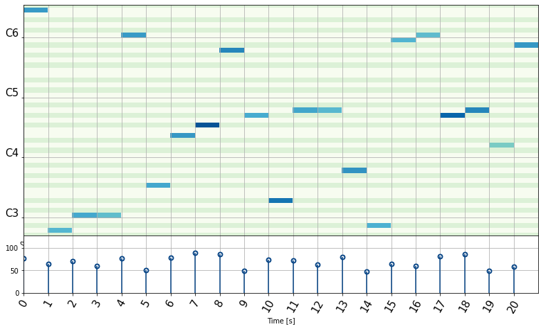

# Writing Documentation
In Fortepyan, we are using [mkdocstrings](https://mkdocstrings.github.io/python/) to automaticaly generate documentation from docstrings.

We are using [Google style docstrings](https://sphinxcontrib-napoleon.readthedocs.io/en/latest/example_google.html) format.

## Adding new pages

To add a new page, you need to create a new .md file in the `docs/` directory. After that, edit the `mkdocs.yml` file and add the new page to the `nav` section. You can learn more about how mkdocs works [here](https://squidfunk.github.io/mkdocs-material/).

## Docstrings

Let's take a closer look at trim method of the MidiPiece class:

```python
"""
        Trim a segment of a MIDI piece based on specified start and finish parameters, with options for different slicing types.

        This method modifies the MIDI piece by selecting a segment from it, based on the `start` and `finish` parameters.
        The segment can be selected through different methods determined by `slice_type`. If `shift_time` is True,
        the timing of notes in the trimmed segment will be shifted to start from zero.

        Args:
            start (float | int): The starting point of the segment. It's treated as a float for 'standard' or 'by_end' slicing types,
                                and as an integer for 'index' slicing type.
            finish (float | int): The ending point of the segment. Similar to `start`, it's treated as a float or an integer
                                depending on the `slice_type`.
            shift_time (bool, optional): Whether to shift note timings in the trimmed segment to start from zero. Default is True.
            slice_type (str, optional): The method of slicing. Can be 'standard', 'by_end', or 'index'. Default is 'standard'. See note below.

        Returns:
            MidiPiece: A new `MidiPiece` object representing the trimmed segment of the original MIDI piece.

        Raises:
            ValueError: If `start` and `finish` are not integers when `slice_type` is 'index', or if `start` is larger than `finish`.
            IndexError: If the indices are out of bounds for 'index' slicing type, or if no notes are found in the specified range for other types.
            NotImplementedError: If the `slice_type` provided is not implemented.

        Examples:
            Trimming using standard slicing:
            >>> midi_piece.trim(start=1.0, finish=5.0)

            Trimming using index slicing:
            >>> midi_piece.trim(start=0, finish=10, slice_type="index")

            Trimming with time shift disabled:
            >>> midi_piece.trim(start=1.0, finish=5.0, shift_time=False)

            An example of a trimmed MIDI piece:
            

        Slice types:
            The `slice_type` parameter determines how the start and finish parameters are interpreted. It can be one of the following:

                'standard': Trims notes that start outside the [start, finish] range.

                'by_end': Trims notes that end after the finish parameter.

                'index': Trims notes based on their index in the DataFrame. The start and finish parameters are treated as integers

        """
        ...
```

This is a general structure you should follow when writing docstrings. You can learn more about how mkdocstrings renders docstrings [here](https://mkdocstrings.github.io/python/usage/).

### Rendering docs
After you have written the docstrings, to see the changes in the documentation, make sure you put:
```
::: fortepyan.directory.module_name

```
In the respective .md file. You could also use optional parameters to a singular module, like so:
```
::: fortepyan.directory.module_name
    options:
        show_root_toc_entry: false
```
There are more options you can use, you can learn more about them in mkdocstrings [documentation](https://mkdocstrings.github.io/python/usage/).
