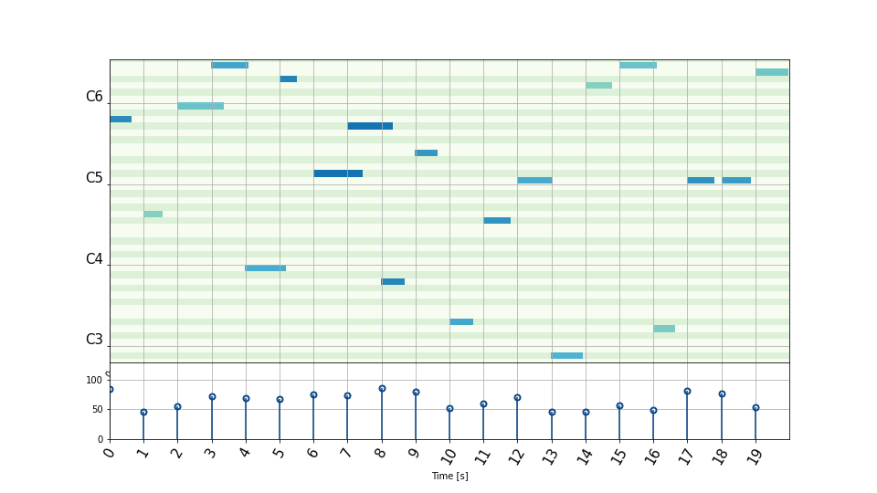

# Example usage of Fortepyan

As a first example, we will create a random midi piece and display it as a piano roll.

``` py title="Getting started"
import pandas as pd
import numpy as np

import fortepyan as ff

from matplotlib import pyplot as plt
from fortepyan.view.pianoroll.main import draw_pianoroll_with_velocities

np.random.seed(42) # Fix the seed for reproducibility

# Create a dataframe with random values
random_df = pd.DataFrame(
    {
        "start": [i for i in range(0, 100)],
        "duration": [np.random.uniform(0.5, 1.5) for i in range(0, 100)],
        "pitch": [np.random.randint(45, 90) for i in range(0, 100)],
        "velocity": [np.random.randint(45, 90) for i in range(0, 100)],
    }
)
random_midi = ff.MidiPiece(random_df) # Create a MidiPiece object

# Let's assume we're interested in notes 5-24
interesting_part = random_midi.trim(5, 24, slice_type="index")
fig = draw_pianoroll_with_velocities(interesting_part)

plt.show()

```

The outcome you should expect is:

